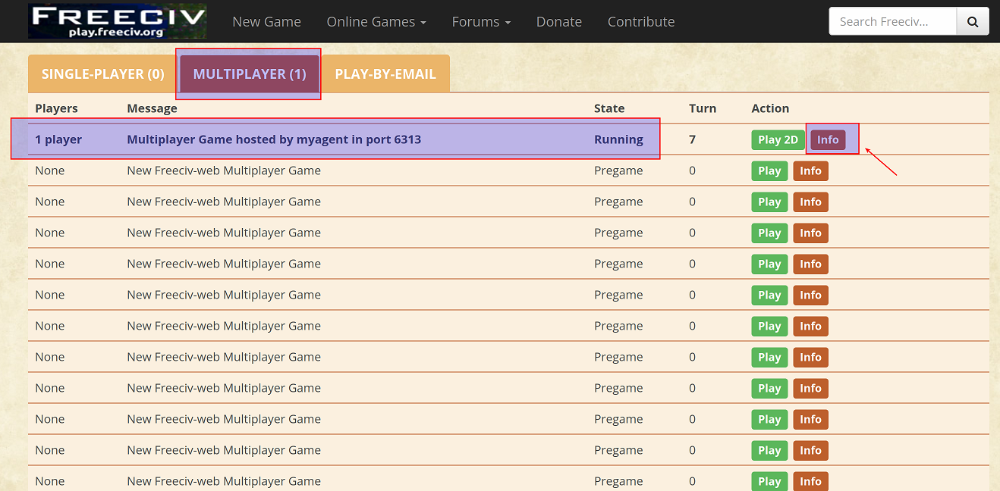
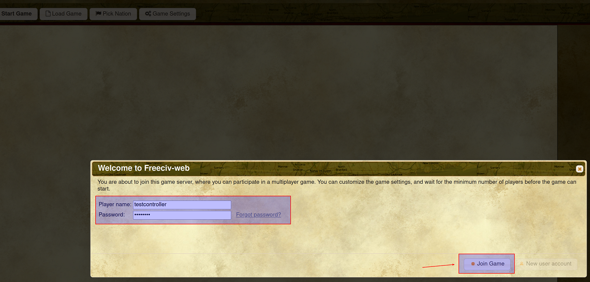
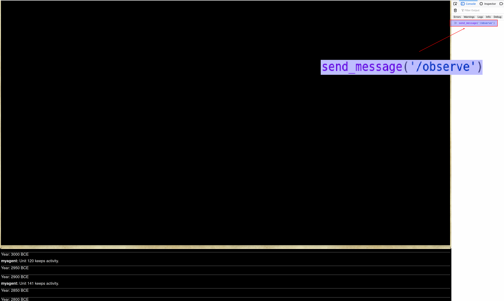
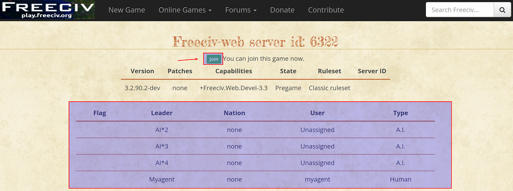
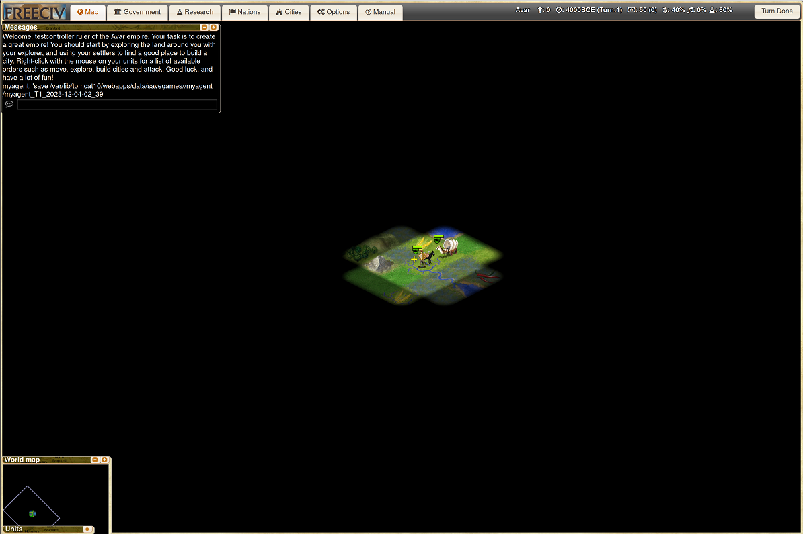

# Visualization

!!! warning "Disclaimer"
    The screenshots displayed on this website result from running the Freeciv game, and they may contain names of nations, players, leaders, or territories that could be politically sensitive. It is important to note that these names are purely hypothetical and are part of the game's design.

## Access The Game

To observe the game play, you can access the game through <http://localhost:8080/> on a browser. Then, please click the "Online Games" button. You can find the running game under the "MULTIPLAYER" tab as shown below. Or alternatively, you can directly go to this page by clicking <http://localhost:8080/game/list?v=multiplayer>.

## Observe the Game Play

1. In the following page, you can click the "info" button pointed by the arrow and go to the information page.
    

2. In the information page, you can see the name of all players currently playing in the game. Then, you can click the "Join/Observe" button pointed by the arrow to join the game as an observer.
    

3. In the below, we use "testcontroller" as the username and click the "Join Game" button to join. Note that you may use another username to log in as long as the username is different from the player names that are already used in the game. The password is "civrealm" for all accounts by default.
    

4. Since the game has started before you join, you will see a black screen after you join. To observe the game play, you need to send the "observe" command through the console of the explorer. Taking Firefox explorer as an example, you may press "ctrl+shift+I" to start the console. Then, in the console, you can type "send_message("/observe")" to send the command as pointed by the arrow in the above figure.
    

    !!! tip
        You can start the game after the observer joins. Please see [the next section](#observe-the-game-play-before-the-game-starts) for more details.

5. You will be able to observe the game from a global view, i.e., you can see the game play of all players, as shown below.
    

5. To observe the game play of a certain player, you may type "send_message("/observe PLAYER_NAME")" in the console. In the below, we observe the game play of the player whose player name is "myagent". The command we type is "send_message('/observe myagent')".
    

## Observe the Game Play Before the Game Starts

To prevent the game from starting before the observer joins, you can use the "wait_for_observer" configuration to force the game to wait.

```bash
test_civrealm --wait_for_observer=True
```

1. Then, under the "MULTIPLAYER" tab, you will see the game status is "Pregame". In comparison, the game status will be "Running" if the game has started. Similarly, you can click the "Info" button to see the information page.
    

2. You may click the "Join" button to join as an observer by using the "testcontroller" account as before. Note that because the game is waiting, you will see the following pregame page instead of a black screen.
    

3. In the following page, you may send the "observe" command in the chatbox instead of the console. As pointed by the arrow, we type "/observe myagent" in the chatbox. After we press "Enter" to send the command, the game will start and we can observe the game play of "myagent".
    

4. Note that you may also send the "observe" command in the chatbox during the game play. As pointed by the arrow in the following page, we type "/observe" in the chatbox.
    
    

5. After we send the command, the observation becomes the global view.
    

6. Similarly, if we type "/observe PLAYER_NAME" in the chatbox, we will see the individual player's view. Note that there could be empty spaces inside a player name as shown in the below.
    
    In the above case, to observe its game play, you have to send the "observe" command through the console of explorer. Moreover, you need to decorate the empty spaces inside the player name with ' ' as shown below. Otherwise, the server cannot read the player name correctly. Following this format, the command we type in the console is "send_message("/observe Philippe' 'le' 'Bon")".
    

    As shown below, by sending the "observe" command, we are able to observe the game play of AI player "Philippe le Bon".
    
